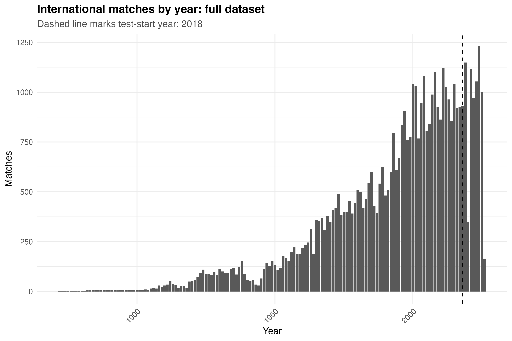
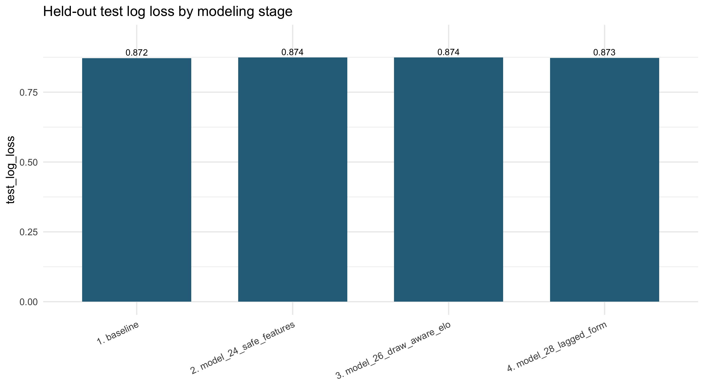
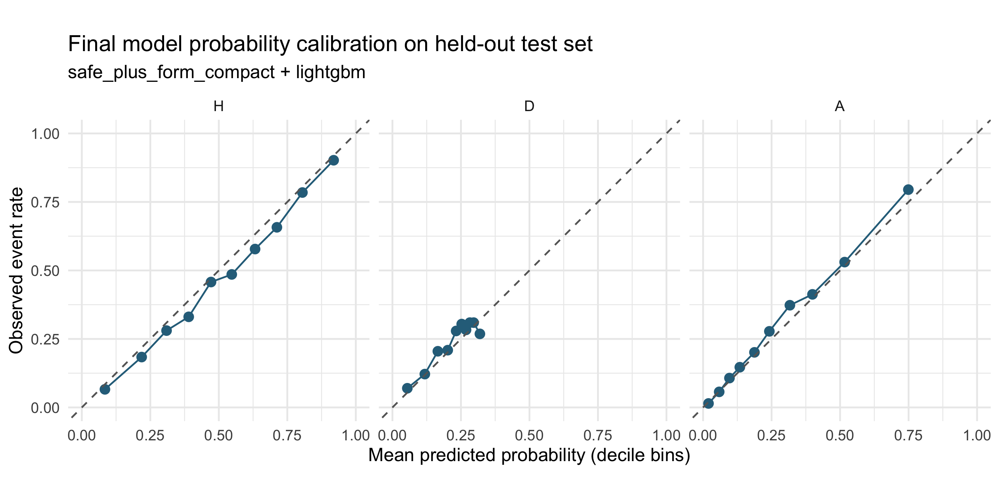
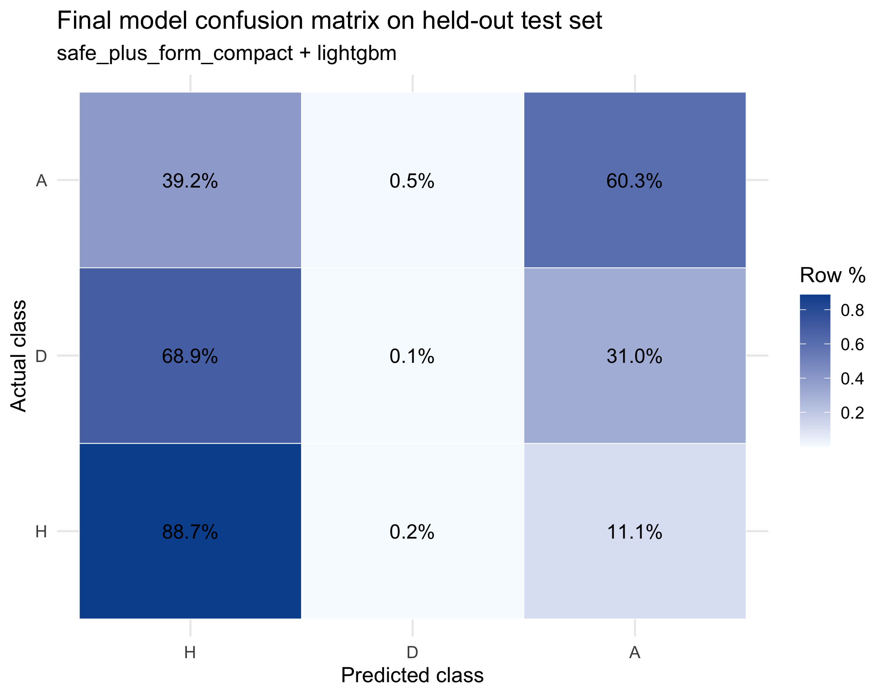
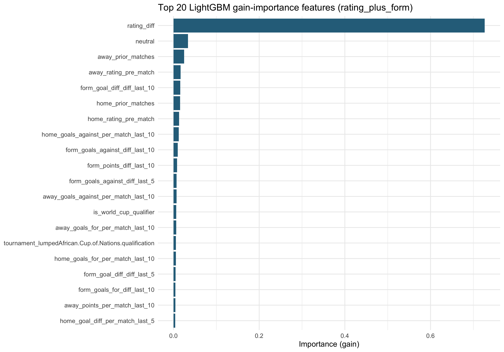
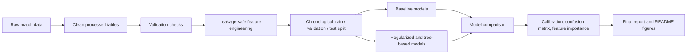

# International Match Forecasting (R)

Predict **home win / draw / away win** probabilities for international association football matches using leakage-safe pre-match features, chronological evaluation, and documented validation.

The **main project** is international match outcome forecasting (multiclass H/D/A). **StatsBomb Open Data** and **football-data.co.uk** are optional side tracks for club-level data; they are not required to reproduce the headline international results.

## Documentation

Start with the **[project overview](docs/project_overview.md)** — the reviewer-facing map of objectives, data, pipeline, and where to look next.

| Document | Description |
|----------|-------------|
| [docs/project_overview.md](docs/project_overview.md) | Reviewer-facing overview **(start here)** |
| [docs/model_selection_rationale.md](docs/model_selection_rationale.md) | Portfolio final vs tier robustness vs challenger |
| [docs/script_map.md](docs/script_map.md) | Script inventory and track separation |
| [docs/pipeline.md](docs/pipeline.md) | Script-by-script pipeline reference |
| [docs/data_sources.md](docs/data_sources.md) | Raw files, processed outputs, limitations |
| [docs/data_dictionary.md](docs/data_dictionary.md) | Column definitions |
| [docs/leakage_audit.md](docs/leakage_audit.md) | Feature timing and exclusion rules |
| [docs/modeling_plan.md](docs/modeling_plan.md) | Modeling stages and feature tiers |
| [docs/evaluation_plan.md](docs/evaluation_plan.md) | Metrics, splits, selection protocol |

**Recommended reproduction path** (from the project root; see [Reproduce](#reproduce) for package install):

```bash
Rscript src/run_light_pipeline.R
Rscript src/run_modeling_pipeline.R
```

## Project goal

Build a reproducible pipeline that forecasts international match outcomes as **calibrated H / D / A probabilities**, with explicit leakage controls, chronological splits, and transparent model selection on **validation log loss** (test metrics reported only after selection).

## Data sources

| Source | Role |
|--------|------|
| [martj42/international_results](https://github.com/martj42/international_results) | Match results, goalscorers, shootouts |
| [World Football Elo](http://www.eloratings.net/) | Pre-match team strength ratings |
| [StatsBomb Open Data](https://github.com/statsbomb/open-data) | Optional club/event context (heavy) |
| [football-data.co.uk](https://www.football-data.co.uk/) | Optional club results + odds (heavy) |

## Leakage-safe feature policy

- Features use only information available **before** kickoff (Elo as-of match date, tournament context, lagged form from prior matches).
- Post-match scores, lineups, and in-match events are excluded from the modeling matrix.
- Details: [docs/leakage_audit.md](docs/leakage_audit.md).

## Evaluation protocol

- **Splits:** chronological train → validation → test on the modeling table (not random).
- **Selection metric:** validation multiclass **log loss**.
- **Test split:** held out for final reporting; not used for hyperparameter or feature-set selection.

## Final models (three roles — do not conflate)

| Role | Configuration | Val log loss | Notes |
|------|---------------|--------------|-------|
| **Preferred portfolio final** | Model 28 — LightGBM + `safe_plus_form_compact` | **0.89309** | Script 31; val *n* = 7,366 |
| **Simpler interpretable challenger** | Model 28 — multinom + `safe_plus_form_compact` | 0.89485 | Same cohort; Δ +0.00176 (< 0.005 threshold) |
| **Tier / robustness (different cohort)** | Model 30 — LightGBM + `rating_plus_form` | **0.88884** | Not directly comparable; val *n* = 7,334 |

**Why the portfolio final is defensible:** Model 28 is the official selection pool (`model_28_metrics.csv`), with a documented leakage path and compact form tier. LightGBM beats multinom on validation by only **0.00176** log loss — a **marginal** gain. Model 30’s lower validation metric reflects a **different cohort and feature set**; it is retained as tier analysis, not as a drop-in replacement.

**Held-out test metrics (portfolio final only):** log loss **0.873**, accuracy **59.5%**, macro F1 **0.437** (*n* = 7,561). See [MODEL_CARD.md](MODEL_CARD.md) and [reports/final/final_results_summary.md](reports/final/final_results_summary.md).

## 60-second summary

1. **Data** — International results, goalscorers, shootouts, and Elo ratings are downloaded, cleaned, and validated.
2. **Features** — Pre-match Elo, tournament context, lagged team form, and optional goalscorer depth (tier study).
3. **Models** — Baselines, Elo multinomial, glmnet ridge, and LightGBM on chronological splits.
4. **Selection** — Validation log loss within the Model 28 cohort; test reserved for final reporting.
5. **Result** — Portfolio final: Model 28 LightGBM + compact form. Gains over Elo baselines are modest but real.

## Results at a glance

The project forecasts three-class match outcomes as calibrated probabilities. Figures below use the **portfolio final** (Model 28 LightGBM) unless noted.

### Data scale and chronological splits



### Incremental model improvement



Improvements are modest: Elo baselines are strong; compact lagged form (Model 28) gave the clearest gain on the official staging path.

### Probabilistic calibration



### Class-level behavior and draw difficulty



Draws remain the hardest class to rank as the top prediction.

### Feature interpretability



Importance reflects predictive contribution, not causality. The tier-study plot uses the Model 30 cohort; portfolio diagnostics use Model 28 outputs from script 31.

### Pipeline overview



## Reproduce

From the project root (R ≥ 4.2 recommended):

```bash
# 1. Install R packages (first run only)
Rscript -e 'source("src/01_packages.R")'

# 2. Build international processed tables + validation
Rscript src/run_light_pipeline.R

# 3. Full modeling pipeline (feature review → baselines → ML → final report)
Rscript src/run_modeling_pipeline.R
```

**Lighter paths**

| Command | Use when |
|---------|----------|
| `Rscript src/run_light_pipeline.R` | Refresh international data only |
| `Rscript src/run_pipeline.R` | Full rebuild including StatsBomb + club data (heavy) |
| `Rscript src/run_modeling_pipeline.R` | Modeling only (processed tables must exist) |

`renv` is not configured yet. After confirming package versions locally, run `renv::init()` to pin dependencies.

Raw downloads are gitignored. Place manual fallbacks under `data/raw/` as documented in [docs/data_sources.md](docs/data_sources.md).

## Modeling approach

- **Target:** `match_result` → H / D / A (multiclass).
- **Portfolio table:** `international_modeling_table_with_form.csv` (Model 28).
- **Feature tiers:** baseline Elo → tournament context → lagged form → goalscorer depth (Model 30 tier study).
- **Selection:** validation log loss within Model 28 (`src/31_final_results_visualization.R`).

## Repository structure

```
worldcup-forecast-r/
├── src/                    # Numbered pipeline scripts + run_*.R orchestrators
├── data/
│   ├── raw/                # Source downloads (gitignored)
│   ├── processed/          # Clean modeling-ready tables
│   ├── validation/         # QA CSVs
│   ├── predictions/        # Optional exports (e.g. final_preferred_model_predictions.csv)
│   └── metadata/           # Manifests, team crosswalk
├── reports/
│   ├── figures/            # Final and diagnostic plots
│   ├── tables/             # Metrics, comparisons, model outputs
│   └── final/              # Narrative summaries for reviewers
├── models/                 # Optional serialized models (portfolio final not saved by default)
├── notebooks/              # Exploratory Rmd notebooks
├── docs/                   # Pipeline, data dictionary, leakage audit, plans
├── README.md
├── PROJECT_STATUS.md
└── MODEL_CARD.md
```

## Limitations and future work

- Elo-only baselines are already strong; ML adds modest refinement.
- Draw prediction remains difficult — models often under-rank the draw class.
- Model 28 and Model 30 cohorts differ; harmonize before promoting any Model 30 configuration.
- Early-era matches have sparser ratings and form history.
- No market odds, squad value, or injury features in the published run.
- Optional: `renv`, serialized portfolio final model, cohort-harmonized re-selection.

## Project status

[PROJECT_STATUS.md](PROJECT_STATUS.md) — what is done, known issues, reviewer checklist.

## License

No `LICENSE` file is in the repository yet. Add one before public release; see [docs/license_needed.md](docs/license_needed.md).
