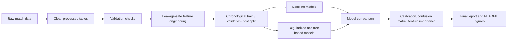

# International Match Forecasting (R)

Predict **home win / draw / away win** probabilities for international association football matches using leakage-safe pre-match features, chronological evaluation, and documented validation.

The **main project** is international match outcome forecasting (multiclass H/D/A). **StatsBomb Open Data** and **football-data.co.uk** are optional side tracks for club-level data; they are not required to reproduce the headline international results.

## Documentation

Start with the **[project overview](docs/project_overview.md)** — the reviewer-facing map of objectives, data, pipeline, and where to look next.

| Document | Description |
|----------|-------------|
| [docs/project_overview.md](docs/project_overview.md) | Reviewer-facing overview **(start here)** |
| [docs/script_map.md](docs/script_map.md) | Script inventory and track separation |
| [docs/pipeline.md](docs/pipeline.md) | Script-by-script pipeline reference |
| [docs/data_sources.md](docs/data_sources.md) | Raw files, processed outputs, limitations |
| [docs/data_dictionary.md](docs/data_dictionary.md) | Column definitions |
| [docs/leakage_audit.md](docs/leakage_audit.md) | Feature timing and exclusion rules |
| [docs/modeling_plan.md](docs/modeling_plan.md) | Modeling stages and feature tiers |
| [docs/evaluation_plan.md](docs/evaluation_plan.md) | Metrics, splits, selection protocol |

**Recommended reproduction path** (from the project root; see [Reproduce](#reproduce) for package install and optional runs):

```bash
Rscript src/run_light_pipeline.R
Rscript src/run_modeling_pipeline.R
```

## 60-second summary

1. **Data** — Historical international results, goalscorers, shootouts, and World Football Elo ratings are downloaded, cleaned, and validated.
2. **Features** — Pre-match Elo, tournament context, lagged team form, and goalscorer depth features are built using only information available before kickoff.
3. **Models** — Frequency/majority baselines, Elo-only multinomial models, glmnet ridge, and LightGBM are compared on the same chronological splits.
4. **Evaluation** — Model selection uses **validation log loss**; a held-out test set is reserved for final reporting. Calibration and classwise metrics are checked explicitly.
5. **Result** — The best incremental gain came from compact lagged form features (Model 28: LightGBM, test log loss **0.874**, accuracy **59.5%**). Gains over strong Elo baselines are modest but real.

See [reports/final/final_results_summary.md](reports/final/final_results_summary.md) and [MODEL_CARD.md](MODEL_CARD.md) for headline metrics.

## Results at a glance

The project forecasts three-class match outcomes — **home win (H), draw (D), and away win (A)** — as calibrated probabilities, not just predicted labels. Models are trained and compared on **chronological train, validation, and test splits** so that pre-match features never use information from future matches. **Log loss** is the primary selection metric because the deliverable is probabilistic; accuracy and macro F1 are reported for context. The figures below walk through data scale, incremental improvement, calibration quality, class-level behavior (including the draw-class difficulty), and feature interpretability.

### Data scale and chronological splits


The modeling dataset spans decades of international matches, with volume increasing in recent eras. Vertical split boundaries mark the chronological train, validation, and test partitions used throughout the project. This design mirrors real forecasting: models are fit on the past and evaluated on held-out future matches, reducing the risk of optimistic metrics from random or leaky splits.

### Incremental model improvement


Test-set log loss tracks performance as feature tiers are added — from Elo baselines through safe pre-match features to compact lagged form. Improvements are **modest but meaningful**: strong Elo-only baselines already explain much of the signal, and supervised models refine probabilities rather than replacing that foundation. The best incremental gain came from compact lagged form features (Model 28: LightGBM, test log loss **0.874**), not from adding every available feature tier.

### Probabilistic calibration


Because the model outputs **H / D / A probabilities**, calibration matters as much as headline accuracy. This plot compares predicted probability bins to observed outcome frequencies on the held-out test set. Well-calibrated forecasts mean that when the model assigns ~60% to a class, that class occurs roughly 60% of the time — a requirement for downstream uses such as simulation or risk-aware decision-making.

### Class-level behavior and draw difficulty


The confusion matrix shows where the model gets each outcome right or wrong at the class level. Home and away wins are predicted more reliably than draws; **draws remain the hardest class** and are often under-ranked as the top predicted label even when draw probability is in a plausible range. This is an honest limitation of the current feature set and class structure, not a reason to overstate overall performance.

### Feature interpretability


Feature importance highlights which pre-match signals the tree model relies on most — primarily Elo rating differences, tournament context, and compact lagged form metrics. These rankings support **interpretability** (the model uses plausible football signals) but should not be read as **causal proof** that changing a feature would change match outcomes. Importance reflects predictive contribution within this dataset and evaluation setup.

### Pipeline overview



## Reproduce

**Recommended path** for the main international workflow: `run_light_pipeline.R` then `run_modeling_pipeline.R` (steps 2–3 below). Use `run_pipeline.R` only if you need the optional StatsBomb or football-data.co.uk side tracks.

From the project root (R ≥ 4.2 recommended):

```bash
# 1. Install R packages (first run only)
Rscript -e 'source("src/01_packages.R")'

# 2. Build international processed tables + validation
Rscript src/run_light_pipeline.R

# 3. Full modeling pipeline (feature review → baselines → ML → final report)
Rscript src/run_modeling_pipeline.R
```

**Lighter paths**

| Command | Use when |
|---------|----------|
| `Rscript src/run_light_pipeline.R` | Refresh international data only |
| `Rscript src/run_pipeline.R` | Full rebuild including StatsBomb + club data (heavy) |
| `Rscript src/run_modeling_pipeline.R` | Modeling only (processed tables must exist) |

`renv` is not configured yet. After confirming package versions locally, run `renv::init()` to pin dependencies.

Raw downloads are gitignored. Place manual fallbacks under `data/raw/` as documented in [docs/data_sources.md](docs/data_sources.md).

## Data sources

| Source | Role |
|--------|------|
| [martj42/international_results](https://github.com/martj42/international_results) | Match results, goalscorers, shootouts |
| [World Football Elo](http://www.eloratings.net/) | Pre-match team strength ratings |
| [StatsBomb Open Data](https://github.com/statsbomb/open-data) | Optional club/event context (heavy) |
| [football-data.co.uk](https://www.football-data.co.uk/) | Optional club results + odds (heavy) |

## Modeling approach

- **Target:** `match_result` → H / D / A (multiclass).
- **Splits:** Chronological train → validation → test on `international_modeling_table.csv`.
- **Feature tiers:** baseline Elo → + tournament context → + lagged form → + goalscorer depth.
- **Selection metric:** validation log loss (test set untouched during selection).
- **Leakage controls:** documented in [docs/leakage_audit.md](docs/leakage_audit.md).

## Repository structure

```
worldcup-forecast-r/
├── src/                    # Numbered pipeline scripts + run_*.R orchestrators
├── data/
│   ├── raw/                # Source downloads (gitignored)
│   ├── processed/          # Clean modeling-ready tables
│   ├── validation/         # QA CSVs (processed_data/, engineered_features/, modeling/)
│   ├── predictions/        # Model prediction exports
│   └── metadata/           # Manifests, team crosswalk
├── reports/
│   ├── figures/            # Final and diagnostic plots
│   ├── tables/             # Metrics, comparisons, model outputs
│   └── final/              # Narrative summary for reviewers
├── models/                 # Saved model objects (by family)
├── notebooks/              # Exploratory Rmd notebooks
├── docs/                   # Pipeline, data dictionary, leakage audit, plans
├── README.md
├── PROJECT_STATUS.md
└── MODEL_CARD.md
```

## Important caveats

- Elo-only baselines are already strong; ML adds modest refinement, not a large step change.
- Draw prediction remains difficult — models often under-rank the draw class despite reasonable draw *probabilities*.
- Early-era matches have sparser ratings and form history; complete-case cohorts differ slightly across feature tiers.
- StatsBomb event/360 processing is optional and can take hours; it is not required for the international forecasting story.

## Project status

[PROJECT_STATUS.md](PROJECT_STATUS.md) — what is done, known issues, reviewer checklist. Full `docs/` index: [Documentation](#documentation) above.

## License

Open source — see LICENSE if present.
